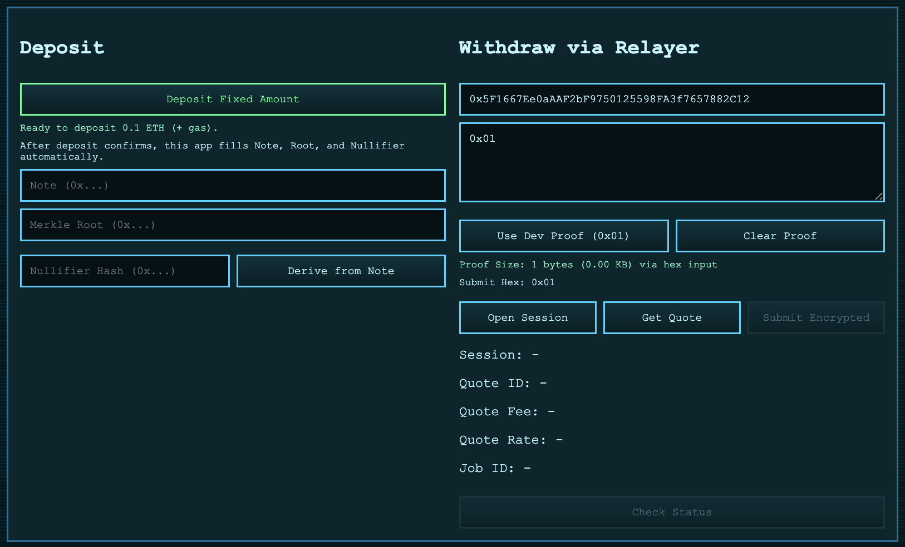

# BlueARC

Post-quantum-oriented privacy pool with:
- On-chain privacy pool contracts (`contracts/`)
- Relayer service with encrypted session handshake + durable storage (`relayer/`)
- React frontend with 8-bit green/blue UI (`web/`)
- Design and API docs (`docs/`)
- One-command containers (`docker-compose.yml`)
  
## Front-End:

Branding:
- Product: `BlueARC`
- Protocol: `BlueARC Privacy Protocol`
- Relayer network: `BlueARC Relay Mesh`
- UI tag: `BLUEARC // 8BIT`

## Notes
- `PqVerifierAdapter` supports explicit backend modes (`bytes` or `uint`) for real verifier integration.
- Production deploys require `EXTERNAL_VERIFIER_ADDRESS`; dev verifier deploy is opt-in only.
- Relayer persists quotes/jobs in Postgres and sessions/nonces/rate limits in Redis.
- Relayer handshake uses true `ML-KEM-768 (Kyber)` encapsulation + server decapsulation.
- Relayer publishes runtime config (`/health`, `/config`) including auto-detected `defaultPool` from deploy JSON path when configured.
- Remote signer mode supports KMS/HSM-style signing services (`SIGNER_MODE=remote`).
- TLS/mTLS is configurable on relayer listener via `TLS_*` variables.
- Pool includes owner-controlled `baseRelayerFee`, `protocolFeeBps`, and treasury routing for protocol profit.
- Protocol fees are custodied in `ProtocolTreasury` with queued timed owner withdrawals.
- Contracts use OpenZeppelin `Ownable` and `ReentrancyGuard`.
- Relayer anonymity is privacy-hardened but not absolute; see docs.

## Relay Host Packaging
- Railway service config: `/Users/proteu5/Documents/Github/PQE-Cash/relayer/railway.json`
- Host compose stack (good for Raspberry Pi/VPS): `/Users/proteu5/Documents/Github/PQE-Cash/relayer/docker-compose.host.yml`

- ## SepoliaETH
- Deployer: 0x5F1667Ee0aAAF2bF9750125598FA3f7657882C12
- ExternalVerifier: 0x5d9aB94bB4B0d4b7660Ce5F44dE46894DF0D2466 (backend=bytes, deployed=true)
- PqVerifierAdapter: 0x5245355b3e43837B3D519DFff3Da272Ab151Ff92
- PrivacyPool: 0x0999D3Aa4e8CF3F4A2d1D855d3D4874984df0083

